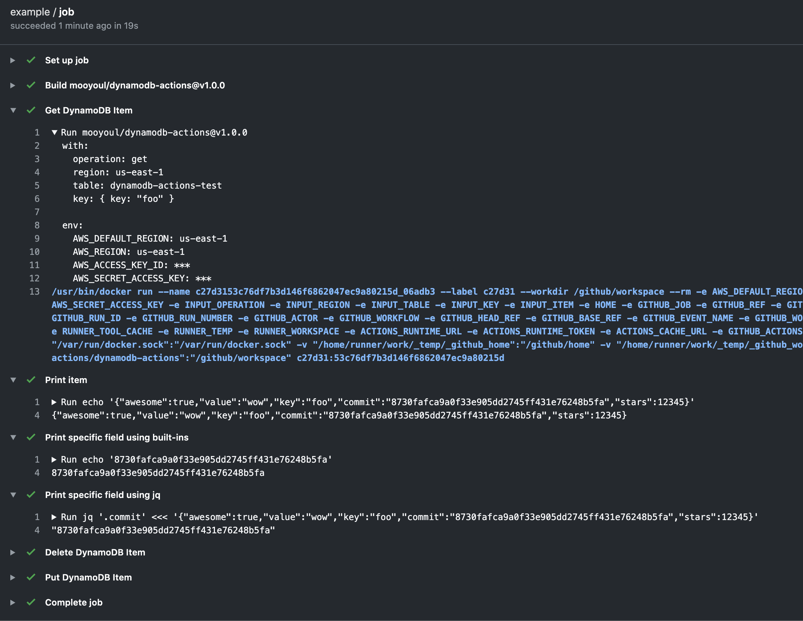

# dynamodb-actions

[](https://github.com/mooyoul/dynamodb-actions/actions)
[](https://github.com/mooyoul/dynamodb-actions/actions)
[](https://github.com/semantic-release/semantic-release)
[](https://renovatebot.com/)
[](http://mooyoul.mit-license.org/)

GitHub action that integrates with Amazon DynamoDB.

Inspired from [DynamoDB integration in AWS Step Functions](https://docs.aws.amazon.com/step-functions/latest/dg/connect-ddb.html)

-----



## Supported Operations

### Get Item

Get Item from DynamoDB and Returns JSON-serialized Item payload.

##### Example

```yaml
# ...
jobs:
  job:
    runs-on: ubuntu-latest
    timeout-minutes: 5
    steps:
      - name: Get DynamoDB Item
        id: config
        uses: mooyoul/dynamodb-actions@v1.0.0
        env:
          AWS_DEFAULT_REGION: us-east-1
          AWS_REGION: us-east-1
          AWS_ACCESS_KEY_ID: ${{ secrets.AWS_ACCESS_KEY_ID }}
          AWS_SECRET_ACCESS_KEY: ${{ secrets.AWS_SECRET_ACCESS_KEY }}
        with:
          operation: get
          region: us-east-1
          table: my-awesome-config
          key: |
            { key: "foo" }
      - name: Print Value
        run: jq '.field' <<< ${{ steps.config.outputs.item }}
```


##### Input

```typescript
type GetItemInput = {
  operation: "get";
  region: string;
  table: string;
  key: { 
    [key: string]: string | number;
  };
}
```

##### Output

JSON-serialized item will be set to `item` output.

### Put Item

Put Item to DynamoDB

##### Example

```yaml
# ...
jobs:
  job:
    runs-on: ubuntu-latest
    timeout-minutes: 5
    steps:
      - name: Put DynamoDB Item
        uses: mooyoul/dynamodb-actions@v1.0.0
        env:
          AWS_DEFAULT_REGION: us-east-1
          AWS_REGION: us-east-1
          AWS_ACCESS_KEY_ID: ${{ secrets.AWS_ACCESS_KEY_ID }}
          AWS_SECRET_ACCESS_KEY: ${{ secrets.AWS_SECRET_ACCESS_KEY }}
        with:
          operation: put
          region: us-east-1
          table: my-awesome-config
          item: |
            { 
              key: "foo",
              value: "wow",
              awesome: true,
              stars: 12345
            }
```


##### Input

```typescript
type PutItemInput = {
  operation: "put";
  region: string;
  table: string;
  item: { 
    [key: string]: any;
  };
}
```

##### Output

None.


### Delete Item

Delete Item from DynamoDB

##### Example

```yaml
# ...
jobs:
  job:
    runs-on: ubuntu-latest
    timeout-minutes: 5
    steps:
      - name: Delete DynamoDB Item
        uses: mooyoul/dynamodb-actions@v1.0.0
        env:
          AWS_DEFAULT_REGION: us-east-1
          AWS_REGION: us-east-1
          AWS_ACCESS_KEY_ID: ${{ secrets.AWS_ACCESS_KEY_ID }}
          AWS_SECRET_ACCESS_KEY: ${{ secrets.AWS_SECRET_ACCESS_KEY }}
        with:
          operation: delete
          region: us-east-1
          table: my-awesome-config
          key: |
            { key: "foo" }
```

##### Input

```typescript
type DeleteItemInput = {
  operation: "delete";
  region: string;
  table: string;
  key: { 
    [key: string]: string | number;
  };
}
```

##### Output

None

## FAQ

#### How to select specific field?

Use Github Actions built-in `fromJson` function.

For example:
```yaml
- name: Print specific field
  run: |
    echo ${{ fromJson(steps.[id].outputs.item).[field] }}
```

Alternatively, You can also Use [jq](https://stedolan.github.io/jq/). [Github-hosted runners already have pre-installed jq.](https://help.github.com/en/actions/reference/software-installed-on-github-hosted-runners).

For example:
```yaml
- name: Print specific field
  run: |
    jq '.field' <<< echo '${{ steps.[id].outputs.item }}'
``` 

## Wishlist

- Add Consistent Read option to get operation
- Add UpdateItem operation
- Add conditional writes (e.g. putItem / updateItem)

## License

[MIT](LICENSE)

See full license on [mooyoul.mit-license.org](http://mooyoul.mit-license.org/)
